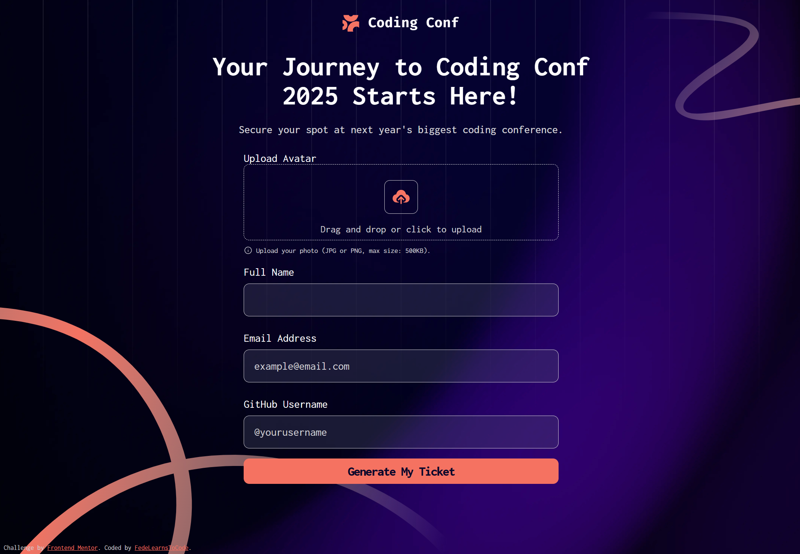

# Frontend Mentor - Conference ticket generator solution

This is a solution to the [Conference ticket generator challenge on Frontend Mentor](https://www.frontendmentor.io/challenges/conference-ticket-generator-oq5gFIU12w). Frontend Mentor challenges help you improve your coding skills by building realistic projects.

## Table of contents

- [Overview](#overview)
  - [The challenge](#the-challenge)
  - [Screenshot](#screenshot)
  - [Links](#links)
- [My process](#my-process)
  - [Built with](#built-with)
  - [What I learned](#what-i-learned)
  - [Continued development](#continued-development)
  - [Useful resources](#useful-resources)
- [Author](#author)
- [Acknowledgments](#acknowledgments)

## Overview

### The challenge

Users should be able to:

- Complete the form with their details
- Receive form validation messages if:
  - Any field is missed
  - The email address is not formatted correctly
  - The avatar upload is too big or the wrong image format
- Complete the form only using their keyboard
- Have inputs, form field hints, and error messages announced on their screen reader
- See the generated conference ticket when they successfully submit the form
- View the optimal layout for the interface depending on their device's screen size
- See hover and focus states for all interactive elements on the page

### Screenshot

### Links

Live Site URL: [Add live site URL here](https://your-live-site-url.com)

## My process

### Built with

- HTML5 – Semantic and accessible
- CSS3 – Responsive design with mobile-first approach
- JavaScript (Vanilla) – Form validation, event handling, dynamic generation
- Google Fonts – Inconsolata
- Frontend Mentor Design – Layout inspired by an official challenge

✅ Main Features

- Avatar upload (with preview)
- Form validation (avatar, full name, email, GitHub username)
- Drag & drop file support with visual feedback
- Ticket generation with animation and user data
- Basic accessibility (focus, ARIA, keyboard)
- Responsive design for mobile, tablet, and desktop

### What I learned

While working on this project, I improved both my HTML semantics and form accessibility skills. I learned how to:

- Properly associate labels with input fields to enhance accessibility
- Use aria-live and role="alert" to ensure error messages are announced by screen readers
- Manage focus state and visibility to provide a better user experience and keyboard navigation
- Create responsive layouts and customize file input elements
- Display validation messages in a clear and accessible way

Additionally, I deepened my understanding of client-side form validation using JavaScript.

This experience helped me gain a deeper understanding of how screen readers interpret content and how to improve user interaction with forms.

### Continued development

I’d like to keep learning more about accessibility, especially how to make websites easier to use for everyone. I want to improve how I use semantic HTML, ARIA roles, and keyboard navigation, and get better at testing with screen readers.

I also want to keep working on:

- Writing clear and accessible form validation
- Making sure all elements are usable with the keyboard
- Building websites that work well on different devices and browsers
- My goal is to build websites that are both user-friendly and inclusive.

### Useful resources

These tools help me check if my projects meet accessibility standards and identify areas for improvement:

- [WAVE WEB Accessibility Evaluation Tool ](https://wave.webaim.org/)
- [Accessibility Insights](https://accessibilityinsights.io/)
- Lighthouse (Chrome DevTools)

## Author

- Frontend Mentor - [@FedeLearnsToCode](https://www.frontendmentor.io/profile/FedeLearnsToCode)
